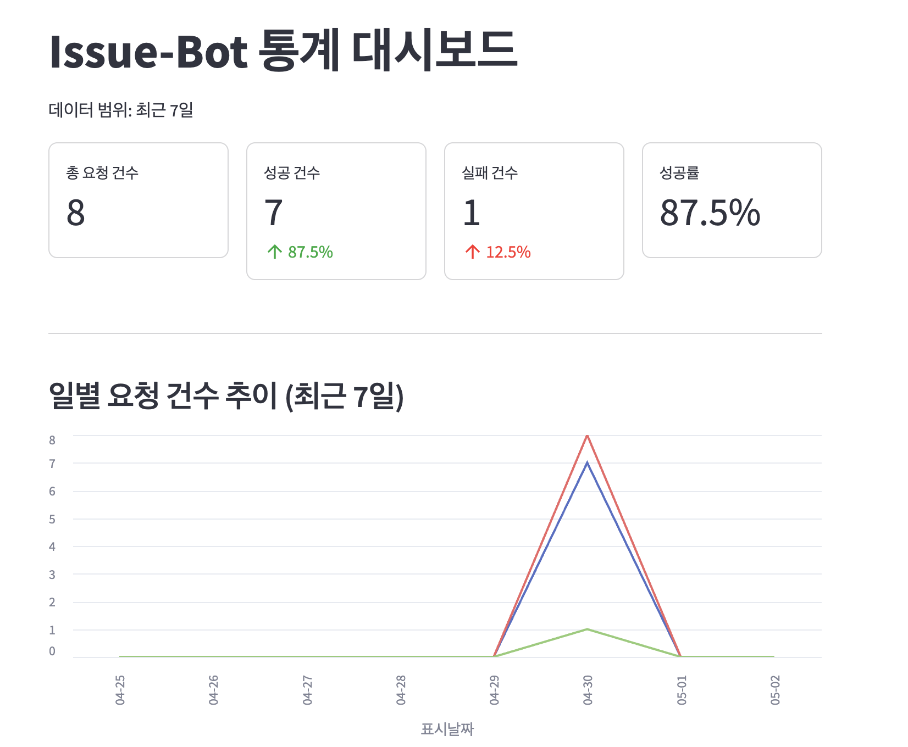
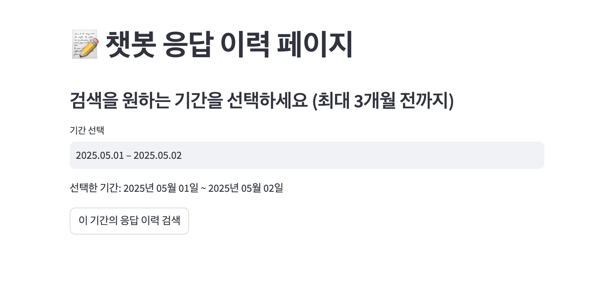

# Issue-Bot 관리자 대시보드

Issue-Bot 관리자 대시보드는 GitHub 이슈 봇 시스템의 관리 및 모니터링을 위한 웹 기반 인터페이스입니다. 이 대시보드를 통해 봇 시스템의 성능을 분석하고, 사용자 활동을 추적하며, 봇의 응답을 확인할 수 있습니다.

## 주요 기능

대시보드는 세 가지 주요 페이지로 구성되어 있습니다:

### 1. 통계 대시보드

통계 대시보드는 Issue-Bot 시스템의 전반적인 성능과 사용 패턴을 시각화합니다.

- **핵심 지표**: 총 요청 건수, 성공 건수, 실패 건수 및 성공률 모니터링
- **추세 분석**: 일별/월별 요청 추이를 차트로 표시
- **사용자 분석**: 활성 사용자 수 및 증감률, Top 5 사용자 통계
- **레포지토리 분석**: 가장 활발한 레포지토리 Top 5 통계



### 2. 분석 페이지

분석 페이지는 이슈 제목과 본문에서 단어 사용 패턴을 분석하고 시각화합니다.

- **단어 분포 분석**: 제목과 본문에서 추출한 주요 키워드를 워드 클라우드로 표시
- **상위 키워드**: 가장 많이 사용된 단어 Top 15를 차트로 표시
- **LLM 분석**: 대규모 언어 모델을 활용한 질문 및 답변 내용 심층 분석



### 3. 챗봇 응답 이력 페이지

챗봇의 실제 응답 이력을 날짜별로 조회하고 분석할 수 있습니다.

- **날짜 기반 검색**: 최대 3개월 전까지의 데이터를 날짜 범위로 검색
- **상세 조회**: 각 이슈의 제목, 본문, 봇 응답을 상세히 확인
- **페이지네이션**: 대량의 응답 결과를 페이지 단위로 탐색

## 설치 및 실행

### 필수 요구사항

- Python 3.8 이상
- Streamlit
- 기타 requirements.txt에 명시된 라이브러리

### 설치 방법

```bash
# 저장소 클론
git clone https://github.com/your-repo/issue-bot.git
cd issue-bot/admin-ui

# 가상환경 생성 및 활성화 (선택 사항)
python -m venv venv
source venv/bin/activate  # Linux/Mac
# 또는
venv\Scripts\activate  # Windows

# 필요한 패키지 설치
pip install -r requirements.txt
```

### 환경 설정

`.env` 파일을 생성하고 다음 설정을 추가합니다:

```
API_SERVER=http://localhost:8001
```

### 실행 방법

```bash
streamlit run app.py
```

기본적으로 http://localhost:8501 에서 대시보드에 접근할 수 있습니다.

## 주의사항

- 대시보드를 사용하기 위해서는 API 서버가 실행 중이어야 합니다.
- 워드 클라우드 기능은 한글 폰트가 시스템에 설치되어 있어야 제대로 동작합니다.
- 데이터 분석 결과는 캐시되므로, 최신 데이터를 보려면 '데이터 새로고침' 버튼을 사용하세요.